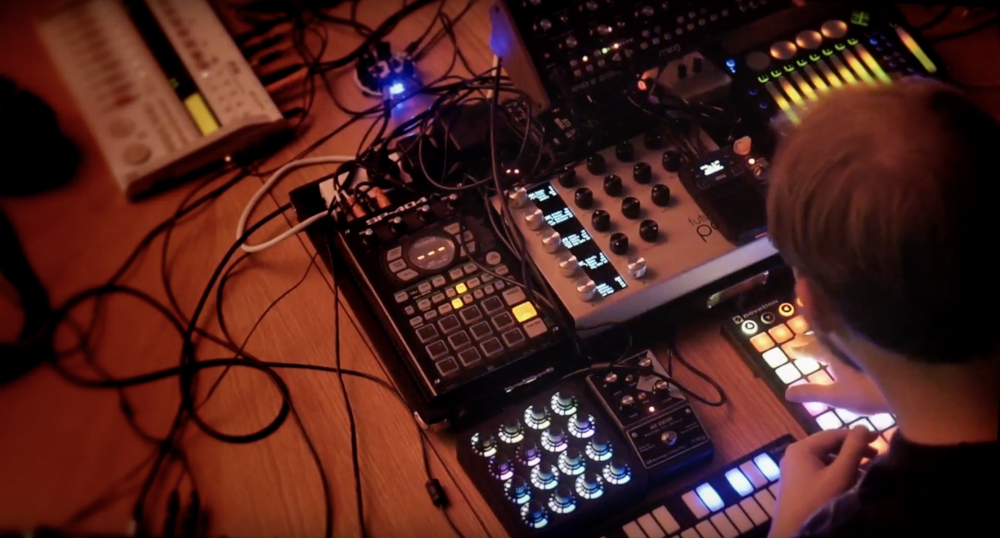

# rust-loop-drop
[WIP] Midi-only version of [Loop Drop](https://github.com/mmckegg/loop-drop-app) for running on low power machines like Raspberry Pi and Beaglebone

> :warning: **This codebase is not currently intended for use outside of my [music setup][2]**
>
> It follows 0-refactor _just make music_ development style, so... eh. But here's the code in all its gory glory, because open source is best source!

[][2]

## DESTROY WITH SCIENCE - Digital Devices 🎶

This repo contains all of the code used to make the album! The head was [1323ff9](https://github.com/mmckegg/rust-loop-drop/commit/1323ff968e169f276c185834e2d93e147c3aebc0) at the time. 

[][1]

> 

You can get it on [Bandcamp](https://destroywithscience.bandcamp.com/album/digital-devices), [Spotify]() and all the other usual places! 

It can also be "obtained" for free via #dat and the [Beaker Browser](https://beakerbrowser.com/) on the condition that you seed it!

```
dat://filez.destroywithscience.com/
```

# License

GNU Affero General Public License v3.0

[1]: https://destroywithscience.bandcamp.com/album/digital-devices
[2]: https://www.youtube.com/watch?v=TPSqQRR517o
